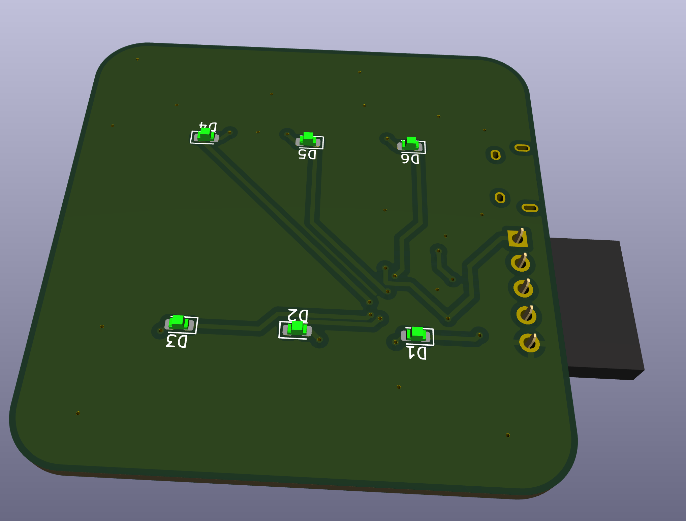
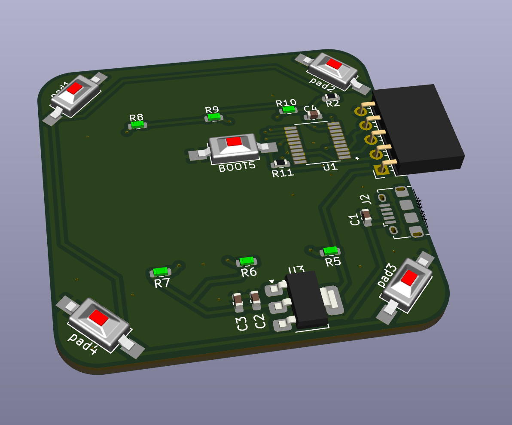
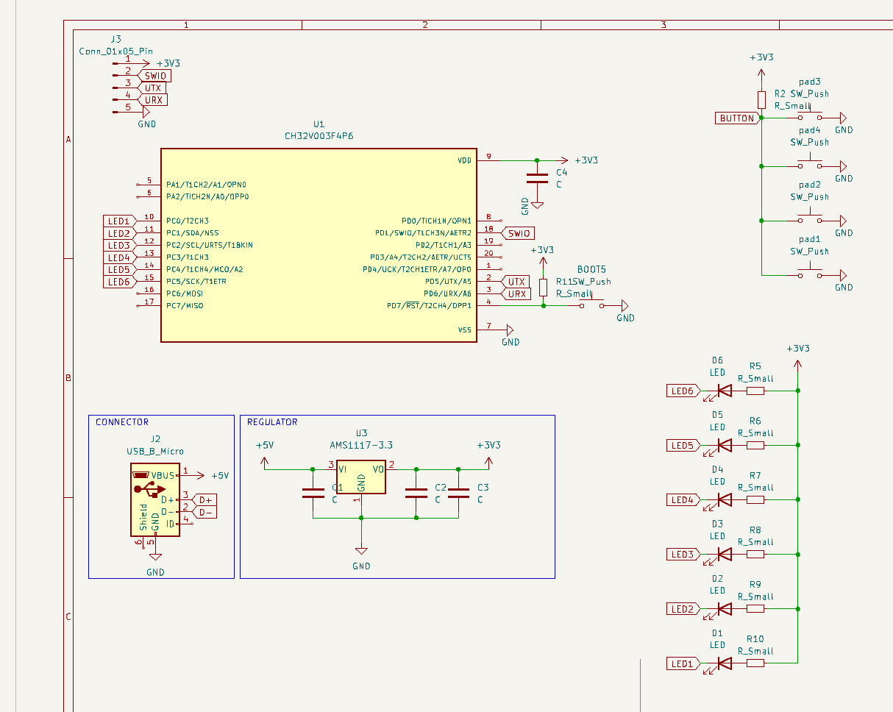
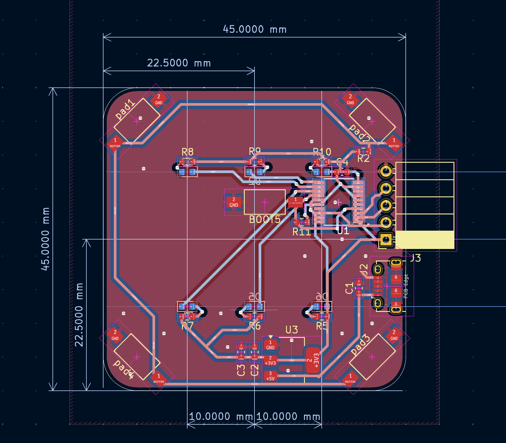

# Just a Dice

An electronic dice based on the CH32V003 RISC-V microcontroller with bottom-mounted switch activation.

## Overview

This project is a compact electronic dice that uses bottom-mounted switch buttons for activation. Simply press the PCB from the bottom to activate the switches and generate a random number displayed on 6 LEDs arranged in a traditional dice pattern.

## Schematic and PCB Layout

## Hardware Features

- **Microcontroller**: CH32V003F4P6 (RISC-V 32-bit)
- **Display**: 6 LEDs arranged in dice pattern (D1-D6)
- **Input**: 4 touch-sensitive pads on bottom (pad1-pad4)
- **Power**: Micro USB connector with onboard 3.3V regulation
- **Programming**: SWD interface with BOOT switch
- **Dimensions**: 45mm x 45mm PCB

## Components

- **U1**: CH32V003F4P6 microcontroller
- **U3**: AMS1117-3.3 voltage regulator
- **D1-D6**: LEDs for dice display
- **R5-R10**: Current limiting resistors for LEDs
- **J2**: Micro USB connector
- **J3**: SWD programming header
- **BOOT5**: Boot mode switch
- **C1-C4**: Decoupling capacitors

## How It Works

1. Power the device via micro USB
2. Press anywhere on the bottom of the PCB (touch pads)
3. The microcontroller generates a random number (1-6)
4. The corresponding LED pattern displays the result

## Programming

The CH32V003 can be programmed via the SWD interface using the onboard programming header (J3). Hold the BOOT switch while powering on to enter programming mode.

## License

This project is licensed under the CERN Open Hardware Licence Version 2 - Strongly Reciprocal (CERN-OHL-S).

## Files

- `hardware/`: KiCad PCB design files
- `schematic.png`: Circuit schematic
- `pcb.png`: PCB layout
- `3d_top.png`: 3D render of PCB top
- `3d_bottom.png`: 3D render of PCB bottom showing touch pads

## Getting Started

1. Assemble the PCB with all components
2. Program the CH32V003 with dice firmware
3. Connect via micro USB
4. Press the bottom to roll the dice!
